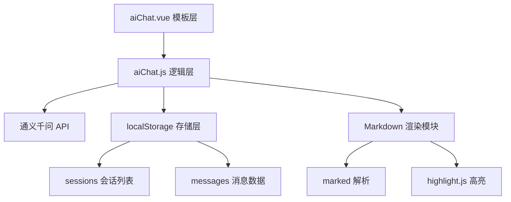

## 产品概述

在现有薪资管理系统中新增一个AI交互聊天功能页面，用户可以与通义千问AI进行对话交流。页面采用Element Plus企业级风格，支持流式输出、Markdown渲染和历史会话管理。

## 核心功能

- **基础对话能力**：用户可以输入消息发送给AI，接收并展示AI的回复内容
- **流式输出**：AI回复以逐字/逐句方式实时流式显示，提供更自然的交互体验
- **Markdown渲染与代码高亮**：AI回复中的Markdown格式文本正确渲染，代码块支持语法高亮
- **对话记录保存**：所有对话消息自动保存到localStorage，刷新页面不丢失
- **历史会话列表**：支持创建新会话、切换历史会话、删除会话，会话列表持久化存储

## 技术选型

- **前端框架**：Vue 3（Composition API）+ Vite
- **UI 组件库**：Element Plus 2.x
- **状态管理**：Vue 3 reactive + localStorage
- **HTTP 请求**：axios（直接调用通义千问 API）
- **Markdown 渲染**：marked + highlight.js
- **流式处理**：fetch API + ReadableStream（SSE 流式响应）

## 实现方案

### 整体策略

在 `src/page/demo/` 下新建 `aiChat` 文件夹，遵循项目现有模式（一个 .vue 模板 + 一个 .js 逻辑文件）。采用 Composition API 编写业务逻辑，使用 localStorage 管理会话和消息数据的持久化。

### 关键技术决策

1. **通义千问 API 对接**：使用通义千问的 DashScope API，通过 fetch 的 ReadableStream 实现 SSE 流式读取。由于是外部 API 直接调用，需要在 vite.config.js 中配置代理避免跨域问题。

2. **流式输出实现**：使用 `fetch` + `response.body.getReader()` 读取流式 SSE 数据，逐行解析 `data:` 前缀的 JSON 块，实时更新消息内容实现打字机效果。

3. **Markdown 渲染**：引入 `marked` 库解析 Markdown，`highlight.js` 处理代码块语法高亮。为避免 XSS 风险，对渲染后的 HTML 使用 DOMPurify 或限制标签白名单。

4. **本地存储设计**：设计两个 localStorage key：

- `ai_chat_sessions`：存储会话元数据数组（id、title、createTime、lastTime）
- `ai_chat_messages_{sessionId}`：每个会话的消息数组（role、content、timestamp）

使用 `JSON.stringify/parse` 序列化，设置合理的存储上限（最多保留 50 个会话，每个会话最多 200 条消息）。

5. **性能考量**：

- 消息列表使用虚拟滚动避免大量消息时的渲染性能问题（若消息超过 100 条）
- 流式输出时使用 `requestAnimationFrame` 批量更新 DOM，避免过于频繁的响应式更新
- localStorage 读写使用防抖策略，避免频繁序列化

### 架构设计



- **模板层 (aiChat.vue)**：负责页面布局和交互界面，包含侧边栏会话列表、聊天消息区域、输入框
- **逻辑层 (aiChat.js)**：Composition API setup 函数，管理会话状态、消息状态、API 调用、流式处理
- **API 层**：封装通义千问 API 调用，支持流式和非流式两种模式
- **存储层**：封装 localStorage 读写操作，管理会话和消息的增删改查

## 实现细节

### 目录结构

```
src/page/demo/aiChat/
├── aiChat.vue          # [NEW] 聊天页面模板。包含左侧会话列表侧边栏、中间聊天消息展示区、底部输入框。使用 Element Plus 的 el-drawer/el-menu/el-input/el-button 等组件构建企业级风格界面。聊天消息支持用户消息和AI消息两种样式，AI消息区域支持Markdown渲染。
├── aiChat.js           # [NEW] 聊天页面业务逻辑。使用 Vue 3 Composition API，管理 sessions（会话列表）、currentSession（当前会话）、messages（当前消息列表）、inputText（输入内容）、isStreaming（流式状态）等响应式状态。实现 sendMessage、createNewSession、switchSession、deleteSession 等核心方法。封装通义千问 API 的流式调用逻辑。
└── markdown.js         # [NEW] Markdown 渲染工具模块。封装 marked 和 highlight.js 的配置，提供 renderMarkdown(content) 方法，支持代码块语法高亮、表格、列表等常见 Markdown 语法。
```

### 需要修改的文件

```
src/page/pt/home/navMenu.js    # [MODIFY] 在 initDevTab() 的 demo 子菜单中添加 AI 聊天页面入口
vite.config.js                  # [MODIFY] 添加通义千问 API 的代理配置，解决跨域问题
```

### 关键代码结构

**通义千问 API 调用接口**：

```typescript
// 流式请求
async function streamChat(messages, apiKey) {
  const response = await fetch('/qwen-api/v1/services/aigc/text-generation/generation', {
    method: 'POST',
    headers: {
      'Content-Type': 'application/json',
      'Authorization': `Bearer ${apiKey}`
    },
    body: JSON.stringify({
      model: 'qwen-turbo',
      input: { messages },
      parameters: { result_format: 'message', incremental_output: true }
    })
  })
  // 使用 ReadableStream 逐块读取 SSE 数据
  const reader = response.body.getReader()
  // ... 逐行解析，实时更新消息内容
}
```

**会话数据结构**：

```typescript
interface Session {
  id: string          // uuid
  title: string       // 会话标题（取第一条用户消息截取）
  createTime: number  // 创建时间戳
  lastTime: number    // 最后活跃时间戳
}

interface Message {
  role: 'user' | 'assistant'
  content: string
  timestamp: number
}
```

### 注意事项

- **API Key 安全**：通义千问 API Key 不能硬编码在前端代码中，需要提供输入框让用户自行配置，并存储到 localStorage 中。首次使用时提示用户输入 API Key。
- **错误处理**：网络错误、API 限流、API Key 无效等情况需要给用户友好的提示，使用 ElMessage 显示错误信息。
- **流式中断**：用户可以在 AI 回复过程中点击停止按钮中断流式输出，已接收的部分内容保留。
- **代理配置**：在 vite.config.js 的 server.proxy 中添加 `/qwen-api` 路径代理到 `https://dashscope.aliyuncs.com`。

## 设计风格

采用 Element Plus 企业级设计风格，整体界面简洁专业，色彩沉稳克制。使用 Element Plus 的蓝色主色调作为强调色，结合卡片式布局和柔和的阴影，打造一个与现有薪资管理系统风格统一的AI聊天界面。

## 页面布局

整体采用左右分栏布局：左侧为会话列表侧边栏（宽度约 260px），右侧为聊天主区域。

### 左侧会话列表侧边栏

- 顶部"新建会话"按钮，使用 Element Plus 的 el-button 主色调
- 会话列表项展示会话标题和最后活跃时间，当前选中会话高亮显示
- 每个会话项支持悬停显示删除按钮
- 列表可滚动，底部显示会话总数

### 右侧聊天主区域

- **顶部标题栏**：显示当前会话标题，右侧放置 API Key 设置按钮
- **中间消息区域**：占据主要空间，消息从上到下排列
- 用户消息：右对齐，蓝色背景气泡，圆角设计
- AI 消息：左对齐，白色背景气泡，带边框阴影，支持 Markdown 渲染和代码块高亮
- 流式输出时，AI 消息末尾显示闪烁光标动画
- 自动滚动到最新消息
- **底部输入区域**：固定底部，包含文本输入框（支持 Enter 发送、Shift+Enter 换行）、发送按钮、流式输出时的停止按钮
- **空状态**：无消息时显示欢迎引导语和快捷提问示例

### API Key 设置弹窗

使用 el-dialog 弹窗，包含 API Key 输入框、保存按钮，以及获取 API Key 的引导链接。

## 交互细节

- 发送消息后自动滚动到底部
- 流式输出时发送按钮变为停止按钮
- 会话切换时平滑过渡
- 删除会话需要二次确认
- 消息时间显示为相对时间格式（刚刚、几分钟前、几小时前）